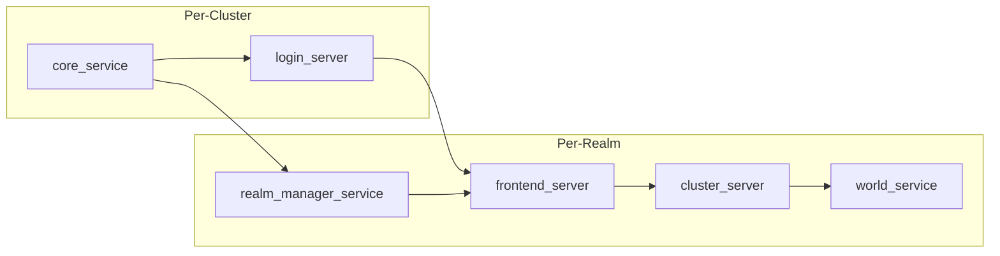

# Anotherland


## Introduction
Welcome to the **Anotherland Server Emulator** project, a community-driven initiative to resurrect the MMORPG, *Otherland*. This emulator aims to recreate the experience of *Otherland* by providing tools and instructions to set up and run your own server for the game.

## Prerequisites
Before you begin, ensure you have the following installed:
- **Rust 1.95.0-nightly** (use rustup to automatically install the correct toolchain)
- **MongoDB** (configured with a replica set so that transactions work)

## Compilation
Clone the repository (including submodules) to your local machine:
```bash
git clone --recurse-submodules https://github.com/AnotherlandServer/anotherland.git
```

Build the project using Cargo:
```bash
cd anotherland
cargo build --release
```

## Architecture
The server is divided into multiple services that can be run across distributed machines.



### Per-cluster services:
- **`core_service`**  
  Provides central services like authentication and realm registration. It serves as the entry point for clients and the central registry for realms. This service also exposes a GraphQL API for internal use.

- **`login_server`**  
  The primary server for clients to connect to. This is the gateway to the *Otherland* cluster and allows clients to select a realm to log into. It exposes the main RakNet connection, the TCP queue, and the TCP verification service. After login, clients are redirected to a `frontend_server` of the selected realm.

### Per-realm services:
- **`realm_manager_service`**  
  The cornerstone for each realm. It manages the realm's database and acts as a registry for cluster frontends and distributed zones.

- **`world_service`**  
  Responsible for running the game's world. 

- **`frontend_server`**  
  A staging area for clients immediately after connecting to a realm. It serves clients until they’ve selected a character, at which point they are redirected to one of the `cluster_server` endpoints.

- **`cluster_server`**  
  Routes connected clients’ requests to the appropriate zone or dungeon server.

## Running the Server
### Bootstrap
1. Start the `core_service` and wait for the GraphQL interface to become available. Use the [Rover CLI](https://www.apollographql.com/docs/rover) with the `rover dev` command to launch an IDE for interfacing with the GraphQL API.  
2. Use the `createRealm` mutation to create your first realm.  
3. Start the `realm_manager_service` with the `--realm-id` parameter, specifying the ID of the realm you just created.  
4. Once the service is fully started, use the `seed-realm` tool to seed the realm database by extracting content from the *Otherland* client files.  
5. After seeding the realm, build the quests and dialogue trees using `quest-compiler`.
6. After that, build navmeshes using `navmesh_builder generate-mesh`.  
7. After completing these steps, start the remaining services (`login_server`, `world_service`, `frontend_server`, and `cluster_server`) and connect to your realm.
8. For subsequent starts, launching the services in this order is sufficient. There is no need to seed the realm again or build navmeshes (unless you add another realm).

### General Notes
- Use the `--help` argument with each process to view available options and default values.  
- When specifying public addresses (e.g., for the `frontend_server`), avoid using `127.0.0.1`, as the *Otherland* client cannot connect to it—even on the same machine.

## Connecting to a Server
1. Open `UnrealEngine3/AmunGame/Config/DefaultUI.ini` within the client’s folder and locate the line:
   ```
   +ConfigureLoginAddress=(srvName="#UI.EU_Server_LIVE#", srvAddress="78.46.105.144", srvPort=6112, queuePort=53292)
   ```
   Replace `srvName` with any label you like. Set `srvAddress` to the public IP of your server. If you run Anotherland with default parameters, you don’t need to modify `srvPort` or `queuePort`.

2. Open `Atlas/data/otherlandgame/config/clientcfg.ini` and locate the line:
   ```
   verificationSrv =78.46.105.144
   ```
   Replace the IP address with the public IP of your server to enable Steam login.

## Contribution
There are many ways to support Anotherland. Coding is only one of them.

### Coding
If you’ve fixed a bug or added a feature, open a pull request!  
We welcome contributions of all sizes, from small clean-ups to major systems.

**Guidelines for Pull Requests**
- Keep PRs focused. Small, reviewable chunks are easier to merge.  
- Write a short but clear description of what changed and why.  
- Comment tricky code, especially when it depends on quirks of the original client or reverse-engineered behavior.  
- Logs or reproducible steps help when reporting runtime changes.  

**Good Areas to Contribute**
- **Bug fixes**: small but vital improvements.  
- **Refactoring**: simplifying or modernizing messy code.  
- **Tooling**: scripts, debug helpers, or build improvements that make life easier.  
- **Feature restoration**: implementing gameplay systems based on documented evidence (see *Documenting Gameplay Features*).  

Since this is still a small project, there’s no formal issue tracker yet. If you’re unsure where to help, start by experimenting with the code, exploring the game systems, and submitting improvements you find valuable. GitHub Discussions are a good place to coordinate bigger changes.

### Documenting Gameplay Features
Much of *Otherland*’s gameplay has to be reconstructed from video recordings, screenshots, and other archival material.  
We are building a catalogue of how the original systems worked so they can be accurately reimplemented.

Examples of features we want to document:
- **Character progression**: levels, attributes, stat growth  
- **Combat mechanics**: abilities, cooldowns, enemy behavior  
- **Gameplay systems**: quests, dialogues, drops, rewards  
- **Social systems**: guilds, parties, chat channels, mail  

How you can help:
- Share video footage or screenshots you’ve collected (see [discussion #43](https://github.com/AnotherlandServer/anotherland/discussions/43) for videos, [discussion #44](https://github.com/AnotherlandServer/anotherland/discussions/44) for screenshots).  
- Add timestamps, notes, or context (“at 3:12 the player opens the inventory and you can see the item stats).  
- Compare evidence across different sources to spot missing details.  
- Summarize findings into short writeups that future developers can use as specs.

The more evidence we gather, the closer we can get to bringing the original game systems back to life.

### Playtesting
Running the server is only half the fun—breaking it is the other half.  
Playtesting is how we uncover bugs, missing features, and weird edge cases.

**What You Can Do**
- Join the public test server (experimental realm) and try out the latest builds.  
- Run your own local or private instance to poke at different setups.  
- Explore systems that are partially implemented (combat, items, portals) and note where they differ from the original servers. Check GitHub Discussions for updates on current areas of development.  
- Try “stress tests” by logging in multiple clients or gathering a group of players.

**How to Report Findings**
- Share what you found in GitHub Discussions (include logs, screenshots, or steps to reproduce).  
- Don’t worry about polish—any observation helps. 
- Feedback on *game feel* (combat pacing, balancing, etc.) is also valuable, not just crashes and errors.

### Otherland Fan Wiki
In addition to sharing findings here, we encourage contributors to help update the [Otherland Fan Wiki](https://otherland-mmo.fandom.com/wiki/Otherland_MMO_Wiki).  

The wiki is a long-term archive of game knowledge, and documenting features there makes discoveries easier to access for everyone — not just developers.  

**How to Contribute**
- Once a discussion has reached a conclusion (e.g., confirmed quest rewards, item stats, or skill behavior), update or create the corresponding wiki page.  
- Add references to videos, screenshots, or test results where relevant.  
- Keep pages focused on *verified* information; use Discussions for ongoing speculation and research.  

### Community
Not everyone has time to code or test—and that’s fine. Community contributions help keep the project alive.  

**Ways to Contribute**
- Spread the word about Anotherland: let old *Otherland* players know this exists.  
- Share findings, theories, or design notes about how original systems worked.  
- Join GitHub Discussions and contribute to ongoing conversations.  
- Keep an eye out for archival material (old forum posts, wikis, patch notes) and share it with the group.  
- Help organize group play sessions for testing.  

**Why It Matters**
Every piece of knowledge or connection we recover makes the game world a little less lost. Even if you never touch the code, you can still help bring *Otherland* back to life.

## License
This project is licensed under the [AGPL-3.0 License](LICENSE).

## Disclaimer
This project is a fan-based initiative and is not officially affiliated with, endorsed by, or connected to any of the original creators or entities involved in the development of *Otherland*, including Game OL GmbH, DRAGO Entertainment S.A., or Tad Williams. It exists purely to preserve and study a unique part of gaming history. Anotherland is developed and maintained by enthusiasts with no commercial intent and respects the intellectual property rights of the original creators.
